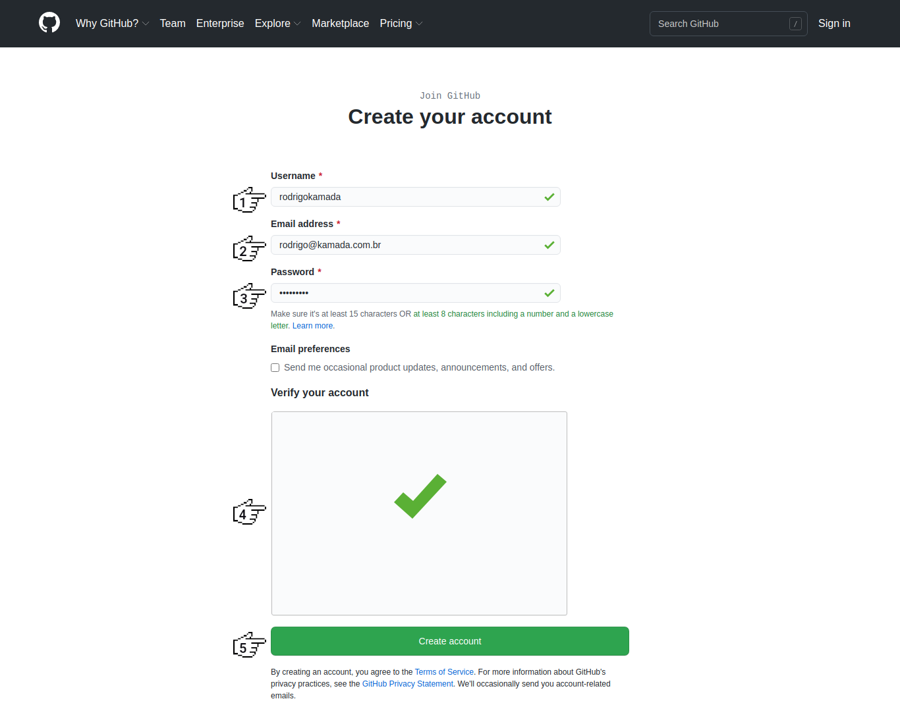
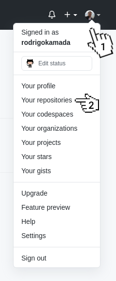
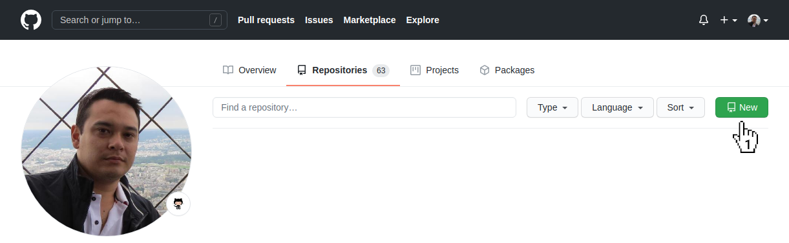
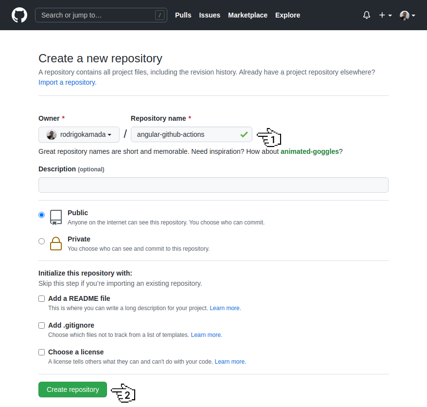
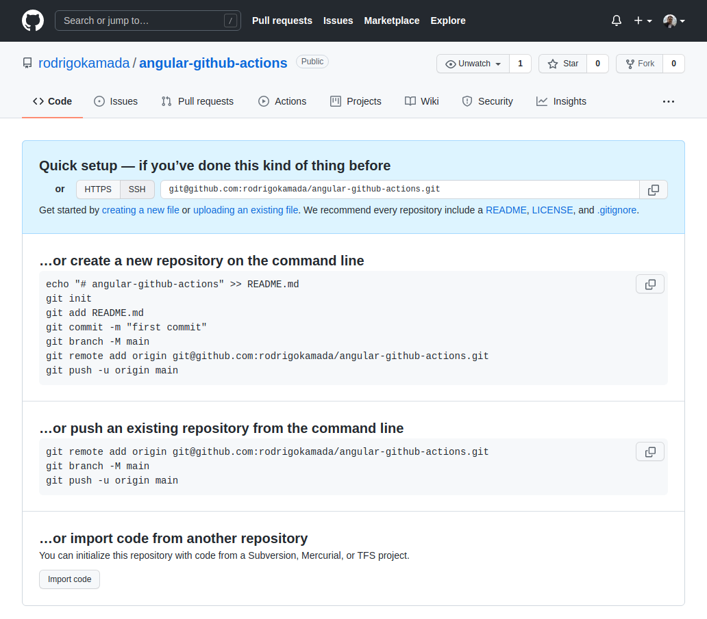
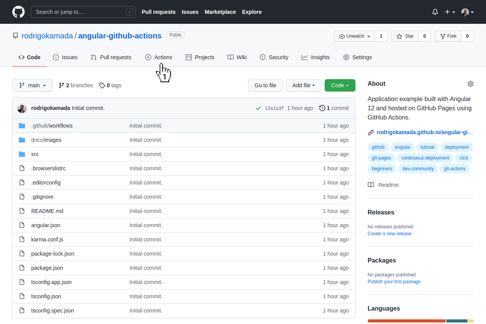
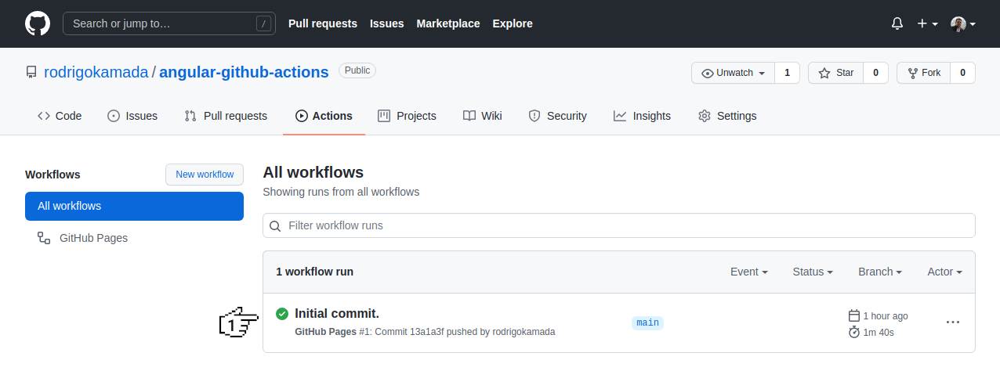
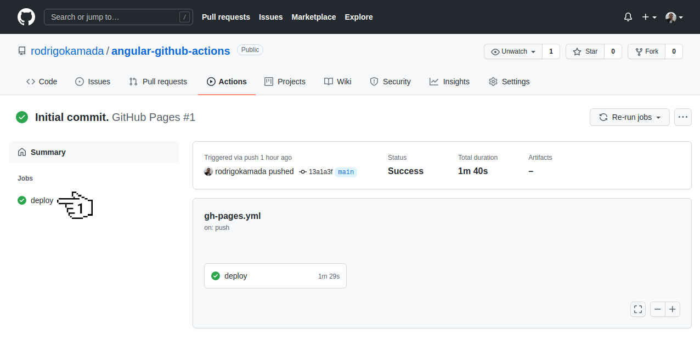
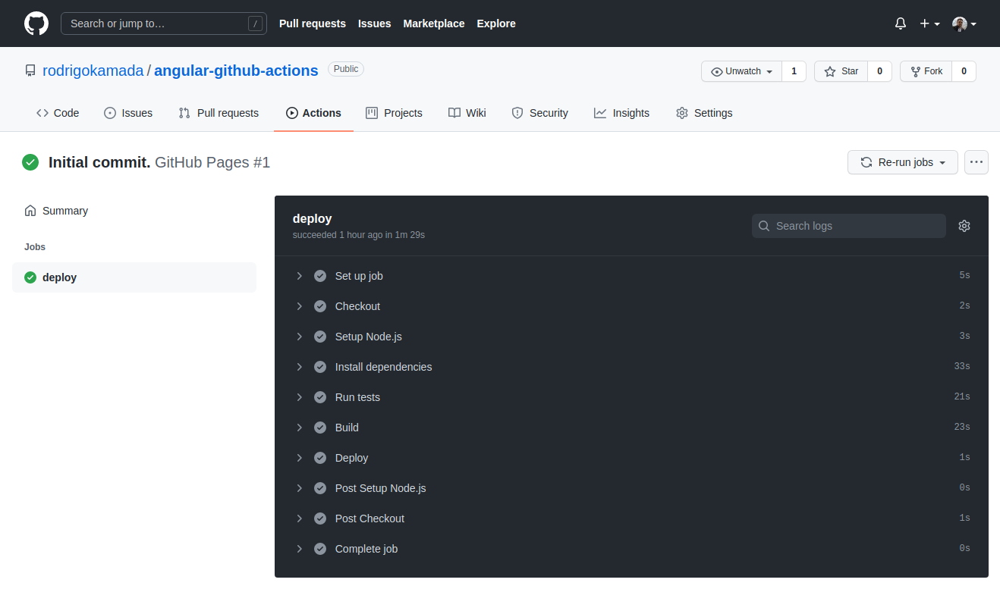

# Angular Github Actions


Application example built with [Angular 12](https://angular.io/) and hosted on [GitHub Pages](https://pages.github.com/) using [GitHub Actions](https://github.com/actions).

This tutorial was posted on my [blog]() in portuguese and on the [DEV Community]() in english.


[](https://rodrigo.kamada.com.br)
[](https://www.linkedin.com/in/rodrigokamada)
[](https://twitter.com/rodrigokamada)


## Prerequisites


Before you start, you need to install and configure the tools:

* [git](https://git-scm.com/)
* [Node.js and npm](https://nodejs.org/)
* [Angular CLI](https://angular.io/cli)
* IDE (e.g. [Visual Studio Code](https://code.visualstudio.com/))


## Getting started


### Create and configure the account on the GitHub


**1.** Let's create the account. Access the site [https://github.com/](https://github.com/) and click on the button *Sign up*.


**2.** Fill in the fields *Username*, *Email address*, *Password*, click on the button *Verify* to solve the challenge and click on the button *Create account*.



**3.** Let's create the repository. Click on the menu with the avatar and click on the menu *Your repositories*.



**4.** Click on the button *New*.



**5.** Fill in the field *Repository name* and click on the button *Create repository*.



**6.** Ready! Account created and repository [`https://github.com/rodrigokamada/angular-github-actions`](https://github.com/rodrigokamada/angular-github-actions) created.




### Create the Angular application


**1.** Let's create the application with the Angular base structure using the `@angular/cli` with the route file and the SCSS style format.

```shell
ng new angular-github-actions
? Would you like to add Angular routing? Yes
? Which stylesheet format would you like to use? SCSS   [ https://sass-lang.com/documentation/syntax#scss                ]
CREATE angular-github-actions/README.md (1066 bytes)
CREATE angular-github-actions/.editorconfig (274 bytes)
CREATE angular-github-actions/.gitignore (604 bytes)
CREATE angular-github-actions/angular.json (3303 bytes)
CREATE angular-github-actions/package.json (1084 bytes)
CREATE angular-github-actions/tsconfig.json (783 bytes)
CREATE angular-github-actions/.browserslistrc (703 bytes)
CREATE angular-github-actions/karma.conf.js (1439 bytes)
CREATE angular-github-actions/tsconfig.app.json (287 bytes)
CREATE angular-github-actions/tsconfig.spec.json (333 bytes)
CREATE angular-github-actions/src/favicon.ico (948 bytes)
CREATE angular-github-actions/src/index.html (306 bytes)
CREATE angular-github-actions/src/main.ts (372 bytes)
CREATE angular-github-actions/src/polyfills.ts (2820 bytes)
CREATE angular-github-actions/src/styles.scss (80 bytes)
CREATE angular-github-actions/src/test.ts (788 bytes)
CREATE angular-github-actions/src/assets/.gitkeep (0 bytes)
CREATE angular-github-actions/src/environments/environment.prod.ts (51 bytes)
CREATE angular-github-actions/src/environments/environment.ts (658 bytes)
CREATE angular-github-actions/src/app/app-routing.module.ts (245 bytes)
CREATE angular-github-actions/src/app/app.module.ts (393 bytes)
CREATE angular-github-actions/src/app/app.component.scss (0 bytes)
CREATE angular-github-actions/src/app/app.component.html (24617 bytes)
CREATE angular-github-actions/src/app/app.component.spec.ts (1121 bytes)
CREATE angular-github-actions/src/app/app.component.ts (227 bytes)
✔ Packages installed successfully.
    Successfully initialized git.
```

**2.** Change the `package.json` file and add the scripts below. Replace the `rodrigokamada` value with your GitHub username.

```json
  "build:prod": "ng build --configuration production --base-href https://rodrigokamada.github.io/angular-github-actions/",
  "test:headless": "ng test --watch=false --browsers=ChromeHeadless"
```

**3.** Run the test with the command below.

```shell
npm run test:headless

> angular-github-actions@1.0.0 test:headless
> ng test --watch=false --browsers=ChromeHeadless

⠋ Generating browser application bundles (phase: setup)...Compiling @angular/core : es2015 as esm2015
Compiling @angular/compiler/testing : es2015 as esm2015
Compiling @angular/common : es2015 as esm2015
Compiling @angular/core/testing : es2015 as esm2015
Compiling @angular/common/testing : es2015 as esm2015
Compiling @angular/platform-browser : es2015 as esm2015
Compiling @angular/router : es2015 as esm2015
Compiling @angular/platform-browser-dynamic : es2015 as esm2015
Compiling @angular/platform-browser/testing : es2015 as esm2015
Compiling @angular/platform-browser-dynamic/testing : es2015 as esm2015
Compiling @angular/router/testing : es2015 as esm2015
⠙ Generating browser application bundles (phase: building)...22 09 2021 20:48:47.533:INFO [karma-server]: Karma v6.3.4 server started at http://localhost:9876/
22 09 2021 20:48:47.537:INFO [launcher]: Launching browsers ChromeHeadless with concurrency unlimited
22 09 2021 20:48:47.541:INFO [launcher]: Starting browser ChromeHeadless
✔ Browser application bundle generation complete.
22 09 2021 20:48:52.326:INFO [Chrome Headless 94.0.4606.54 (Linux x86_64)]: Connected on socket YUmqYxp8kqXTSV63AAAB with id 18515803
Chrome Headless 94.0.4606.54 (Linux x86_64): Executed 3 of 3 SUCCESS (0.185 secs / 0.162 secs)
TOTAL: 3 SUCCESS
```

**4.** Run the application with the command below. Access the URL `http://localhost:4200/` and check if the application is working.

```shell
npm start

> angular-github-actions@1.0.0 start
> ng serve

✔ Browser application bundle generation complete.

Initial Chunk Files | Names         |      Size
vendor.js           | vendor        |   2.41 MB
polyfills.js        | polyfills     | 128.53 kB
main.js             | main          |  56.84 kB
runtime.js          | runtime       |   6.64 kB
styles.css          | styles        |   1.18 kB

                    | Initial Total |   2.60 MB

Build at: 2021-09-22T23:51:24.809Z - Hash: 491013c58e91631f6f14 - Time: 10491ms

** Angular Live Development Server is listening on localhost:4200, open your browser on http://localhost:4200/ **


✔ Compiled successfully.
```

**5.** Build the application with the command below.

```shell
npm run build:prod

> angular-github-actions@1.0.0 build:prod
> ng build --configuration production --base-href https://rodrigokamada.github.io/angular-github-actions/

✔ Browser application bundle generation complete.
✔ Copying assets complete.
✔ Index html generation complete.

Initial Chunk Files               | Names         |      Size
main.4323acf2b7af06c6f196.js      | main          | 215.10 kB
polyfills.846632910956cf45bd88.js | polyfills     |  36.22 kB
runtime.05bbc8c46ec59fd850d7.js   | runtime       |   1.05 kB
styles.31d6cfe0d16ae931b73c.css   | styles        |   0 bytes

                                  | Initial Total | 252.37 kB

Build at: 2021-09-23T01:22:35.870Z - Hash: 3a09fd924c26cb02fafc - Time: 13654ms
```

**6.** Create the `.github/workflows/gh-pages.yml` file.

```shell
mkdir -p .github/workflows
touch .github/workflows/gh-pages.yml
```

**7.** Configure the `.github/workflows/gh-pages.yml` file with the content below.

```yaml
name: GitHub Pages

on:
  push:
    branches:
    - main

jobs:
  deploy:
    runs-on: ubuntu-latest
    steps:
    - name: Checkout
      uses: actions/checkout@v2

    - name: Setup Node.js
      uses: actions/setup-node@v2
      with:
        node-version: '16'

    - name: Install dependencies
      run: npm install

    - name: Run tests
      run: npm run test:headless

    - name: Build
      run: npm run build:prod

    - name: Deploy
      if: success()
      uses: peaceiris/actions-gh-pages@v3
      with:
        github_token: ${{ secrets.GITHUB_TOKEN }}
        publish_dir: dist/angular-github-actions
        enable_jekyll: true
```

**8.** Syncronize the application on the GitHub repository that was created.

**9.** Ready! After synchronizing the application on the GitHub repository, the GitHub Actions build the application and synchronize on the branch `gh-pages`. Access the URL [https://rodrigokamada.github.io/angular-github-actions/](https://rodrigokamada.github.io/angular-github-actions/) and check if the application is working. Replace the `rodrigokamada` value with your GitHub username.


### Validate the run of the GitHub Actions flow

**1.** Let's validate the run of the GitHub Actions flow. Access the repository [https://github.com/rodrigokamada/angular-github-actions](https://github.com/rodrigokamada/angular-github-actions) created and click on the link *Actions*.



**2.** Click on the flow runned.



**3.** Click on the job *deploy*.



**4.** Click on each step to validate the run.



**5.** Ready! We validate the run of the GitHub Actions flow.


## Cloning the application

**1.** Clone the repository.

```shell
git clone git@github.com:rodrigokamada/angular-github-actions.git
```

**2.** Install the dependencies.

```shell
npm ci
```

**3.** Run the application.

```shell
npm start
```
